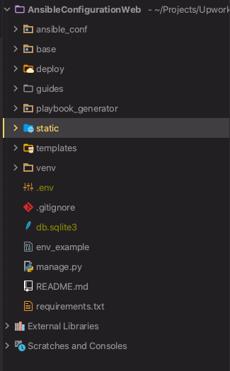

We are using python Django framework

[Simple explanation](https://www.djangoproject.com/start/)

Django has application structure 

[application docs](https://docs.djangoproject.com/en/3.1/ref/applications/)

each application may contain:
* `models` - class based representation of database tables
* `migrations` - history of models changes
* `test` - unit tests
* `forms` - class based handlers for html form 
* `templates` - html template 
* `forms` - folder with html templates
* `admin` - class based configuration of representation models on the django admin page
* `urls` and `view` 
    [how it works](https://docs.djangoproject.com/en/3.1/topics/http/urls/)
    
    ``A clean, elegant URL scheme is an important detail in a high-quality Web application.
    Django encourages beautiful URL design and doesn’t put any cruft in URLs, like .php or .asp.
    To design URLs for an application, you create a Python module called a URLconf.
    Like a table of contents for your app, it contains a simple mapping between URL patterns and your views.``

each url combine path template and view

example:
```python 
path('playbook-form/<str:service_type>/step/upload/', PlaybookUploadStepViewForm.as_view(), name='playbook_step_upload'),

'playbook-form/<str:service_type>/step/upload/' # path where service_type is string parameter
PlaybookUploadStepViewForm.as_view() # view
name='playbook_step_upload' # name for referance in application

```

view - render templates with backend context and handle forms with post, put, delete requests

view example:
```python

class PlaybookUploadStepViewForm(generic.TemplateView):
    template_name = 'step_form_review.html'

    def dispatch(self, request, *args, **kwargs):
        self.uploaded_config = get_object_or_404(ConfigUpload, uuid=kwargs.get("config_uuid"))
        return super().dispatch(request, *args, **kwargs)

    def get_context_data(self, **kwargs):
        not_display_key = [
            'cluster_license', 'aos', 'hypervisor_iso', 'skip_hypervisor', 'hypervisor_version',
            'nos_package', 'is_imaging', 'witness_appliance_version', 'witness_address',
            'cluster_init_successful',
            'ipmi_user', 'ipmi_password', 'asset_tag', 'image_now', 'hypervisor', 'ipmi_configure_now', 'is_bare_metal',
            'vlan_ipmi_name', 'pulse_enabled', 'pulse_email_contact',
            'smtp_address', 'smtp_protocol', 'smtp_port', 'smtp_username', 'smtp_password', 'smtp_security_mode',
            'smtp_address_to', 'smtp_address_from', 'prism_central_ip', 'hypervisor_ip', 'cvm_ip', 'vlan_vm_id_hd'
        ]
        kwargs.update({ 'uploaded_config': self.uploaded_config, 'not_display_key': not_display_key })
        return super().get_context_data(**kwargs)

``` 
template example:

```html


  <div class="uk-flex uk-flex-column uk-flex-center uk-flex-middle upload__form__container">
      <div class="uk-margin uk-f uk-flex uk-flex-column">
      </div>
      <div class="uk-container">
        <p>Ansible is used to deploy, audit and customize the cluster.</p>
        <p>To run the corresponding Ansible playbook SSH to the Ansible server and copy/paste the command below:</p>
        <div class="uk-comment-body">
            <div class="uk-margin">
              <textarea class="terminal uk-textarea" rows="5" placeholder="Textarea" id="copy-text">ansible-playbook {{ nodes_path }} --extra-vars {{ uploaded_config.config_yml_file.path }} --tags "{{ uploaded_config.tag }}"</textarea>
            </div>
        </div>
        <a class="uk-margin-small uk-button uk-button-default" id="copy_btn">Copy</a>
        <p>Monitor the Ansible output for errors/completion.</p>
        <a class="uk-margin uk-button uk-button-default" href="javascript:history.back()">Back to review</a>
      </div>
    </div>
  </div>

```
templates may inherit others templates

#### Project structure




---
**ansible_conf**
- settings - module with all project settings 
    `__init__.py` - entry point
    - important settings:
        - INSTALLED_APPS - list of applications and libraries
        - TEMPLATES - html templates confiig
        - CONFIGS_PATH - path constructo from env vars
- urls.py - entry point for urls:

    ```path('', include(('playbook_generator.urls', 'playbook_generator'))),``` - connecting playbook_generator app 

---
**base** - additional app for abstract things

---
**static** - static files: styles, icons, fonts

---
**static** - static files: styles, icons, fonts

---

**playbook_generator** - application witch controls whole process for generating configs

with `urls.py` easy to understand for which pages using specifically ``Views``, each view has information about template usually it's ``template_name =`` 

### Parsing files and generating configs

To handle post upload request, we are using `PlaybookUploadStepViewForm` method `post`

For abstractions we are using Factory OOP pattern:

see ```file_config_parsers``` ```__init__.py```

in post method ParserFactory we build parser class with:

``parser_class = ParserFactory(event_type=service_type).parser_class(file_contents=file.read())``

``ParserFactory`` return instance of ``NutanixParser`` or `VmWareParser` depends of `service_type` which has been got from url as a parameter

each parser has `parsed_data` properties it's data structure with instruction for store parsed value

in constructor of each parser class we:

- load excel file to class instance
- adding filtered by `service_type` static vars to the `parsed_data`

see:
```python
    def __init__(self, file_contents=None, file_path=None, index_sheet=0):
        if file_contents:
            self.__wbook = xlrd.open_workbook(file_contents=file_contents)
        else:
            self.__wbook = xlrd.open_workbook(filename=file_path)
        self.sheet = self.__wbook.sheet_by_index(index_sheet)
        st = StaticVarsValue.objects.filter(service_type=PlaybookServiceTypes.VMWARE.value)
        for conf in st:
            self.parsed_data.update({
                conf.key : {
                    'name': conf.key,
                    'group': self.STATIC,
                    'is_cluster_json': True,
                    'is_to_playbook': True,
                    'value': conf.value,
               }
            })
``` 
to start parsing calling ``parse_file()`` method

``parser_class.parse_file()`` - this method load parsed values to class instance `parsed_data`

to get json and yaml formats `get_json_dict()` and `get_yml_dict()`

we create item in the database:
```
self.uploaded_config = ConfigUpload.objects.create(parsed_data=parser_class.parsed_data,
                                                             tag=request.POST.get('tags'))
```

we save result of `get_json_dict()` and `get_yml_dict()` to config files following settings `CONFIGS_PATH`
after we add this path to the database item of `ConfigUpload`

finally we redirect user to `PlaybookReviewStepViewForm` with `uuid` of `ConfigUpload`

`PlaybookReviewStepViewForm` loads  `ConfigUpload` item from the database by `uuid` which has been passed to url parameter
and renders vars table and show saved configs paths


---

**templates** - this folder contain base templates for inheriting
    
    `base.html` - is main base template with main information
    `base_internal.html` - common template with side menu


